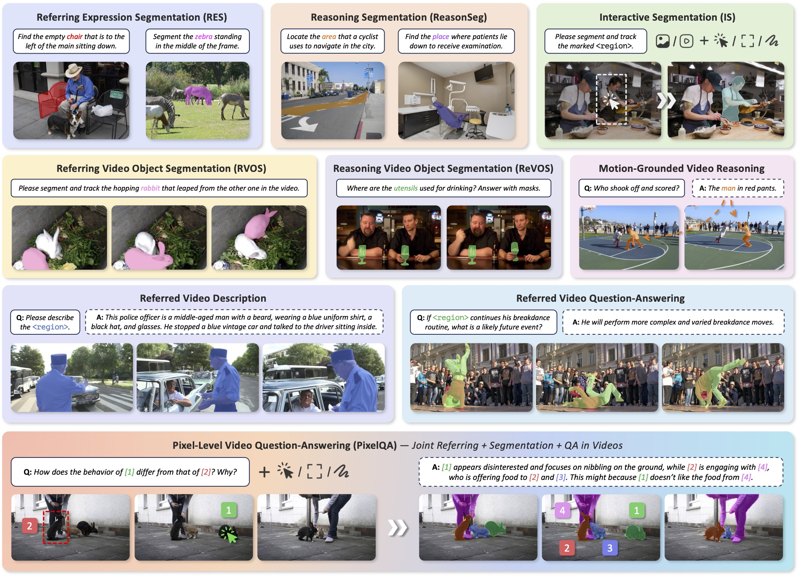
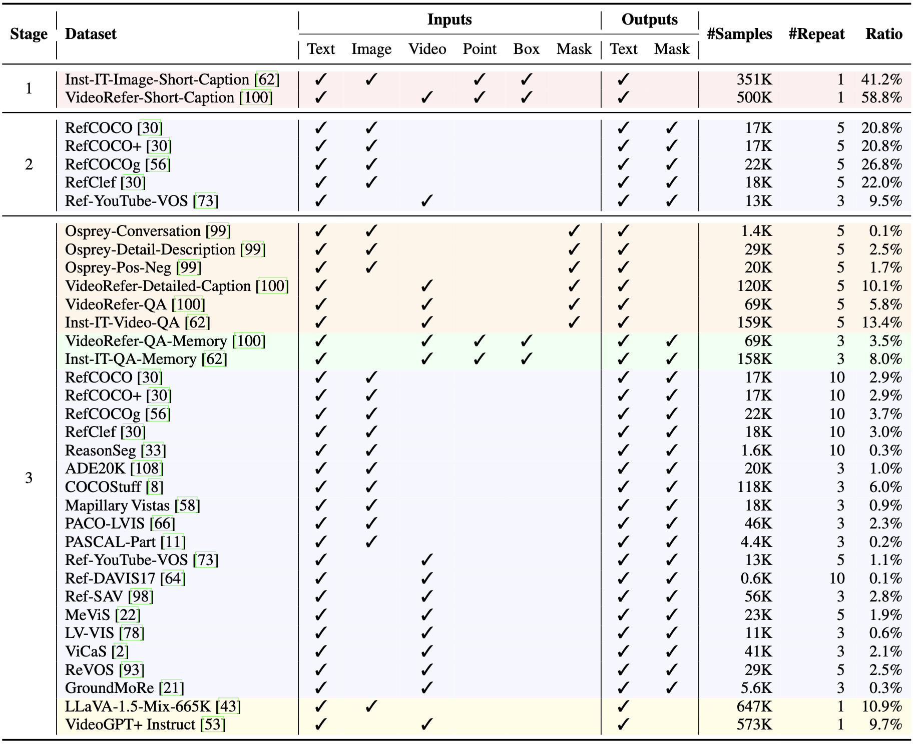

<p align="center">
  
</p>

<h2 align="center">UniPixel: Unified Object Referring and Segmentation<br>for Pixel-Level Visual Reasoning</h2>

<p align="center">
  <a href="https://arxiv.org/abs/2509.18094" target="_blank"></a>
  <a href="https://polyu-chenlab.github.io/unipixel/" target="_blank"></a>
  <a href="https://huggingface.co/collections/PolyU-ChenLab/unipixel-68cf7137013455e5b15962e8" target="_blank"></a>
  <a href="https://modelscope.cn/datasets/yeliudev/UniPixel-SFT-1M" target="_blank"></a>
  <a href="https://huggingface.co/spaces/PolyU-ChenLab/UniPixel" target="_blank"></a>
</p>

<p align="center">
  <a href="https://yeliu.dev/">Ye Liu</a><sup>1,2</sup>, <a href="https://scholar.google.com/citations?user=qtdueToAAAAJ">Zongyang Ma</a><sup>2,3</sup>, <a href="https://pujunfu.github.io/">Junfu Pu</a><sup>2</sup>, <a href="https://zhongangqi.github.io/">Zhongang Qi</a><sup>4</sup>, <a href="https://scholar.google.com/citations?user=T-HaQ84AAAAJ">Yang Wu</a><sup>5</sup>, <a href="https://scholar.google.com/citations?user=4oXBp9UAAAAJ">Ying Shan</a><sup>2</sup>, <a href="https://web.comp.polyu.edu.hk/chencw/">Chang Wen Chen</a><sup>1*</sup>
  <p align="center"><sup>1</sup>The Hong Kong Polytechnic University <sup>2</sup>ARC Lab, Tencent PCG<br/><sup>3</sup>Chinese Academy of Sciences <sup>4</sup>vivo Mobile Communication Co. <sup>5</sup>Tencent AI Lab</p>
</p>

**UniPixel** is a unified MLLM for pixel-level vision-language understanding. It flexibly supports a variety of fine-grained tasks, including image/video segmentation, regional understanding, and a novel PixelQA task that jointly requires object-centric referring, segmentation, and question-answering in videos.

<p align="center"></p>

## 🔥 News

- **`2025.10.03`** 🕹️ Our online demo is available on [Hugging Face Spaces](https://huggingface.co/spaces/PolyU-ChenLab/UniPixel). Enjoy!
- **`2025.09.27`** 🎮 Try our model on custom data [in one click](#-inference-on-custom-data).
- **`2025.09.21`** 🔮 Code, model, and dataset release.
- **`2025.09.18`** 🎉 Our paper has been accepted by [NeurIPS 2025](https://nips.cc/).

## 🏆 UniPixel on Public Benchmarks

| Benchmark                      | Evaluation Results (3B/7B)                                 |
|--------------------------------|------------------------------------------------------------|
| `CT` ReVOS (val)               | `J: 59.7/61.1` `F: 64.4/65.3` `J&F: 62.1/63.2`             |
| `CT` MeViS (val)               | `J: 50.4/52.7` `F: 55.7/57.9` `J&F: 53.1/55.3`             |
| `CT` Ref-YouTube-VOS (val)     | `J: 68.6/69.4` `F: 72.3/72.8` `J&F: 70.5/71.1`             |
| `CT` Ref-DAVIS17 (val)         | `J: 70.7/72.3` `F: 77.8/80.3` `J&F: 74.2/76.3`             |
| `CT` Ref-SAV (val)             | `J: 66.9/70.3` `F: 67.6/72.0` `J&F: 67.2/71.2`             |
| `CT` GroundMoRe (test)         | `J: 36.0/34.7` `F: 38.7/37.3` `J&F: 37.4/36.0`             |
| `CT` RefCOCO (RES)             | `val: 80.5/81.0` `testA: 82.6/83.0` `testB: 76.9/78.0`     |
| `CT` RefCOCO+ (RES)            | `val: 74.3/75.5` `testA: 78.9/80.5` `testB: 68.4/70.1`     |
| `CT` RefCOCOg (RES)            | `val(U): 76.3/76.5` `test(U): 77.0/77.3`                   |
| `CT` ReasonSeg (val)           | `gIoU: 64.0/62.1` `cIoU: 56.2/59.5`                        |
| `CT` VideoRefer-Bench-D        | `single-frame: 3.42/3.17` `multi-frame: 3.44/3.21`         |
| `CT` VideoRefer-Bench-Q        | `single-frame: 72.2/75.3` `multi-frame: 72.8/76.4`         |
| `ZS` MVBench                   | `Acc: 62.5/64.0`                                           |

`CT` and `ZS` refer to multi-task co-training and zero-shot settings, respectively.

## 🕹️ Gradio Demo

🌾 Turn on your sound and enjoy the BGM from [Stardew Valley](https://www.stardewvalley.net/)!

https://github.com/user-attachments/assets/e9a2cb93-7800-4e7a-a452-75adea83dbfb

Play with our demo [online](https://huggingface.co/spaces/PolyU-ChenLab/UniPixel) or see [DEMO.md](/docs/DEMO.md) for guidelines about how to deploy it locally.

## 🎮 Inference on Custom Data

1. Make sure you have [setup the environment](/docs/TRAIN.md#-environment-setup).

2. Run the following script for image or video segmentation.

```shell
# Set the Python Path
export PYTHONPATH="./:$PYTHONPATH"

# Run inference on custom data
python tools/inference.py <media-path> <prompt>

# Example: python tools/inference.py example.jpg 'Please segment the rabbit'
```

Here, `<media-path>` could be a path to an image, a video, or a folder containing video frames (001.jpg, 002.jpg).

<details>
<summary>Here are some example prompts</summary>

```
1. Please segment the tallest giraffe.
2. Where is the nearest sheep? Please provide the segmentation mask.
3. Why is the boy crying? Please provide the segmentation mask and explain why.
4. Who shooted the ball? Please answer the question and provide the segmentation mask.
5. Please segment the object according to the description: <a-long-description>
```
</details>

## 💻 Model Zoo

| Model | Base MLLM | Checkpoint | Training Log |
|:-:|:-:|:-:|:-:|
| UniPixel-3B | [Qwen2.5-VL-3B-Instruct](https://huggingface.co/Qwen/Qwen2.5-VL-3B-Instruct) | [🤗 Link](https://huggingface.co/PolyU-ChenLab/UniPixel-3B) | [🤗 Link](https://huggingface.co/PolyU-ChenLab/UniPixel-3B/resolve/main/trainer_state.json) |
| UniPixel-7B | [Qwen2.5-VL-7B-Instruct](https://huggingface.co/Qwen/Qwen2.5-VL-7B-Instruct) | [🤗 Link](https://huggingface.co/PolyU-ChenLab/UniPixel-7B) | [🤗 Link](https://huggingface.co/PolyU-ChenLab/UniPixel-7B/resolve/main/trainer_state.json) |

## 📦 UniPixel-SFT-1M Dataset

We provide raw images/videos and pre-processed annotations of **23 referring/segmentation/QA datasets**, including our **UniPixel-SFT-1M** for training and multiple benchmarks for evaluation. The list of source datasets is shown below. See our [dataset repo](https://huggingface.co/datasets/PolyU-ChenLab/UniPixel-SFT-1M) for more details.

<p align="center"></p>

## 🚀 Training

Our codebase supports training and evaluating on [23 datasets and benchmarks](https://github.com/PolyU-ChenLab/UniPixel/blob/main/unipixel/dataset/sub_classes) with the following features.

- Flexible hardware settings: NVIDIA GPU / Ascend NPU, Single-Node / Multi-Node
- Efficient training techniques: DeepSpeed ZeRO, BF16, LoRA, SDPA, FlashAttention2, Liger-Kernel
- Customizing the base LLM and conversation templates
- Monitoring the training process via Tensorboard / Wandb
- Group sampling for mixed dataset training
- Multi-process / multi-device evaluation on public benchmarks

See [TRAIN.md](/docs/TRAIN.md) for a quick start guide.

## 🔮 Evaluation

See [EVAL.md](/docs/EVAL.md) for details about evaluating UniPixel on public benchmarks.

## 📖 Citation

Please kindly cite our paper if you find this project helpful.

```bibtex
@inproceedings{liu2025unipixel,
  title={UniPixel: Unified Object Referring and Segmentation for Pixel-Level Visual Reasoning},
  author={Liu, Ye and Ma, Zongyang and Pu, Junfu and Qi, Zhongang and Wu, Yang and Ying, Shan and Chen, Chang Wen},
  booktitle={Advances in Neural Information Processing Systems (NeurIPS)},
  year={2025}
}
```
